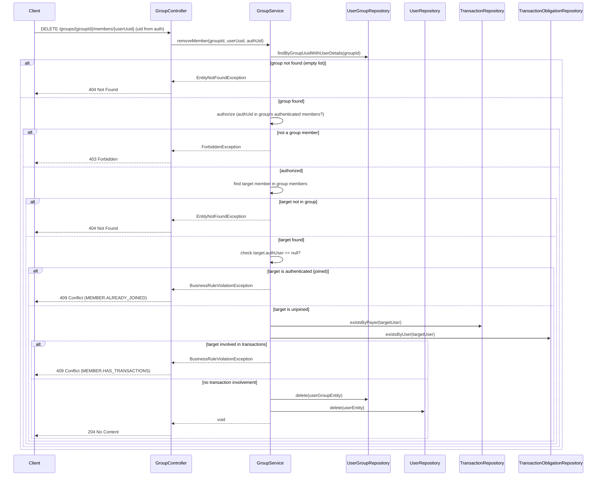

# Design Document

## Overview

`requirements.md` で定義されたドメイン要件（未参加メンバーの削除、削除対象の制限、取引関与メンバーの削除制限、認証・認可、リソース不存在）を、既存レイヤ構造で実現する。

## Design Goals

- 認可チェック（要求者がグループの認証済みメンバーであること）を Service 層で行う
- 削除対象の制限（未参加メンバーのみ削除可能）を Service 層のドメインロジックとして実装する
- 取引関与メンバーの削除制限（支払者・義務者として記録されているメンバーは削除不可）を Service 層で実装する
- 削除はメンバーレコードとグループ関連レコードの両方を除去する完全削除とする
- 既存の認可パターン（add-member と同様の認証済みメンバー判定）を共通メソッドに抽出して再利用する
- 契約情報は OpenAPI に一元化する
- 既存エラーモデルと例外処理基盤を再利用する

## Non-Goals

- HTTP 契約の詳細を Markdown に重複定義しない
- リクエストボディは不要（パスパラメータのみで操作を特定）
- 新規テーブル追加や DB スキーマ変更を行わない
- 削除の監査ログ、通知、Undo 機能は導入しない

## OpenAPI As Contract Source of Truth

Interface / error response は以下を参照し、Design には再定義しない。

- Path: `openapi/paths/groups-groupId-members-userUuid.yaml`
- Parameter: `openapi/components/parameters/groupIdPath.yaml`
- Parameter: `openapi/components/parameters/userUuidPath.yaml`
- Error Schema: `openapi/components/schemas/errors/ErrorResponse.yaml`
- Error Examples:
  - `openapi/components/examples/errors/GROUP_NOT_FOUND.yaml`
  - `openapi/components/examples/errors/USER_NOT_FOUND.yaml`
  - `openapi/components/examples/errors/USER_NOT_GROUP_MEMBER.yaml`
  - `openapi/components/examples/errors/MEMBER_ALREADY_JOINED.yaml`
  - `openapi/components/examples/errors/MEMBER_HAS_TRANSACTIONS.yaml`

変更順序は `requirements.md` → OpenAPI → テスト（RED）→ 実装（GREEN）の順とする。

## Architecture

### Planned Flow

1. Controller が認証済み DELETE リクエストを受理する
2. パスパラメータから `groupId` と `userUuid` を抽出する
3. Controller が認証済み UID とともに Service に委譲する
4. Service がグループのメンバー一覧を取得する（グループ存在確認を兼ねる）
5. グループが存在しない場合は `EntityNotFoundException` で拒否する
6. Service が要求者の認可チェックを行う（認証済み UID がグループの認証済みメンバーに含まれるか）
7. 認可不一致の場合は `ForbiddenException` で拒否する
8. Service が対象メンバーのグループ内存在を確認する
9. 対象メンバーが存在しない場合は `EntityNotFoundException` で拒否する
10. Service が対象メンバーの参加状態を確認する（`authUser` の有無）
11. 対象メンバーが参加済み（`authUser != null`）の場合は `BusinessRuleViolationException` で拒否する
12. Service が対象メンバーの取引関与を確認する（支払者または義務者として記録されているか）
13. 取引に関与している場合は `BusinessRuleViolationException` で拒否する
14. Service が対象メンバーの `UserGroupEntity` と `UserEntity` を削除する
15. Controller が 204 No Content を返却する

## Components and Responsibilities

### Controller Layer

- 役割:
  - 認証済み DELETE リクエストの入口
  - パスパラメータ（`groupId`, `userUuid`）の受け取り
  - 認証済み UID を Service に受け渡す
  - Service への委譲
- 非役割:
  - 認可判定（Service 層の責務）
  - ドメインルール（参加状態の判定・存在確認）は保持しない
  - リクエストボディの処理（本エンドポイントにリクエストボディはない）

### Service Layer

- 役割:
  - グループ存在確認（メンバー一覧取得により暗黙的に確認）
  - 要求者の認可チェック（共通メソッド `validateRequesterIsGroupMember` で `addMember` と共用）
  - 認可不一致時の `ForbiddenException` 送出
  - 対象メンバーのグループ内存在確認
  - 対象メンバーの参加状態判定（`authUser` の有無）
  - 参加済みメンバーへの削除要求時の `BusinessRuleViolationException` 送出
  - 対象メンバーの取引関与確認（支払者・義務者の存在チェック）
  - 取引関与メンバーへの削除要求時の `BusinessRuleViolationException` 送出
  - 未参加メンバーの完全削除オーケストレーション（`UserGroupEntity` → `UserEntity` の順で削除）
- 非役割:
  - HTTP 仕様の解釈
  - 入力の正規化・バリデーション（パスパラメータのみで DTO は不要）

### Repository Layer

- 役割:
  - `UserGroupRepository`: グループメンバー一覧の取得、メンバーとグループの関連削除
  - `UserRepository`: メンバーレコードの削除
  - `TransactionRepository`: 対象メンバーが支払者として記録されているかの存在チェック
  - `TransactionObligationRepository`: 対象メンバーが義務者として記録されているかの存在チェック
- 非役割:
  - ドメインロジック（認可チェック、参加状態判定）
  - 削除順序の制御（Service 層の責務）

## Domain Rules Realization

### Authorization (Req 4)

Service がグループのメンバー一覧を取得した後、認証済み UID がグループの認証済みメンバー（`authUser != null` かつ `authUser.uid == authUid`）に含まれるかを確認する。含まれない場合は `ForbiddenException` を送出する。

この認可パターンは既存の `addMember` メソッドと同一である。DRY 原則に従い、プライベートメソッド `validateRequesterIsGroupMember(List<UserGroupEntity>, String uid)` として抽出し、`addMember` と `removeMember` で共用する。

### Target Restriction (Req 2)

対象メンバーの `authUser` が `null` でない場合（参加済み）、`BusinessRuleViolationException` を送出する。これにより、参加済みメンバーの誤削除を防止する。

要求者自身の削除（Req 2 AC 2）は、要求者が必ず参加済みメンバーであるため、この参加状態チェックにより自動的に拒否される。別途の自己削除チェックは不要。

### Transaction Involvement Check (Req 3)

対象メンバーが取引の支払者（`TransactionHistoryEntity.payer`）または義務者（`TransactionObligationEntity.user`）として記録されている場合、`BusinessRuleViolationException` を送出する。

これはデータ整合性の保護である。`UserEntity` が `TransactionHistoryEntity` と `TransactionObligationEntity` から外部キーで参照されているため、参照がある状態での物理削除は外部キー制約違反となる。ビジネス上も、取引に関与しているメンバーはもはや「誤登録」ではなく「運用データ」であり、削除は適切でない。

### Complete Deletion (Req 1)

削除は以下の順序で行う:
1. `UserGroupEntity` の削除（外部キー制約を考慮し、関連テーブルを先に削除）
2. `UserEntity` の削除

これによりメンバーはグループから完全に除去され、メンバー一覧に表示されず、グループ人数枠も解放される。

### Missing Resource (Req 5)

- グループ不存在: メンバー一覧取得結果が空の場合に `EntityNotFoundException` を送出する（既存パターンと同一）
- メンバー不存在: メンバー一覧内に対象 `userUuid` が見つからない場合に `EntityNotFoundException` を送出する

## Error Handling Design

ステータスコード・エラーコード・レスポンス形式の詳細は OpenAPI path spec を参照:
`openapi/paths/groups-groupId-members-userUuid.yaml`

実装上のエラー処理方針:

- グループ不存在は `EntityNotFoundException`（`GROUP.NOT_FOUND`）を送出する
- メンバー不存在は `EntityNotFoundException`（`USER.NOT_FOUND`）を送出する
- 認可不一致は `ForbiddenException`（`USER.NOT_GROUP_MEMBER`）を送出する
- 参加済みメンバーの削除は `BusinessRuleViolationException`（新規エラーコード `MEMBER.ALREADY_JOINED`）を送出する
- 取引関与メンバーの削除は `BusinessRuleViolationException`（新規エラーコード `MEMBER.HAS_TRANSACTIONS`）を送出する
- 例外変換と最終レスポンス形成は既存 `GlobalExceptionHandler` を利用する
- 認証エラーは `TatecaAuthenticationFilter` で処理される（Controller に到達しない）

### 新規 ErrorCode

| ErrorCode | 用途 |
|-----------|------|
| `MEMBER.ALREADY_JOINED` | 参加済みメンバーに対する削除要求の拒否 |
| `MEMBER.HAS_TRANSACTIONS` | 取引に関与しているメンバーに対する削除要求の拒否 |

## Data and Persistence

- 既存 `users` テーブルと `user_groups` テーブルを利用し、スキーマ変更は行わない
- 削除は `UserGroupEntity` → `UserEntity` の順（外部キー制約の考慮）
- JPA の `delete()` メソッドを使用（ソフトデリートではなく物理削除）

## Testing Design

### 外部仕様テスト

#### Scenario Test (Acceptance)

- 責務: `requirements.md` の Acceptance Criteria が HTTP レベルで充足されることを検証する（ブラックボックス）
- 非責務: レスポンスのスキーマ構造検証（Controller Web Test の責務）、内部実装の詳細（Repository 呼び出し回数等）
- 基盤: `AbstractIntegrationTest` + `MockMvc`（フルスタック）

検証項目:
- 未参加メンバーの正常削除と、削除後のグループ情報での不在確認（Req 1）
- 削除後のグループ人数減少の確認（Req 1）
- 参加済みメンバーの削除拒否（Req 2）
- 要求者自身の削除拒否（Req 2）
- 取引の支払者として記録されている未参加メンバーの削除拒否（Req 3）
- 取引の義務者として記録されている未参加メンバーの削除拒否（Req 3）
- グループ外ユーザーによる削除要求の拒否（Req 4）
- 未認証ユーザーによる削除要求の拒否（Req 4）
- 存在しないグループへの削除要求の拒否（Req 5）
- 存在しないメンバーへの削除要求の拒否（Req 5）

#### Controller Web Test (@WebMvcTest)

- 責務: HTTP インターフェース契約の準拠を検証する（レスポンス構造、ステータスコード、エラー形式）
- 非責務: ビジネスロジックの正しさ（Service は Mock）、データの永続化確認
- 基盤: `@WebMvcTest(GroupController.class)` + `@MockitoBean GroupService`

検証項目:
- 204 No Content のレスポンス（ボディなし）
- 404 Not Found のレスポンス構造と `error_code`（グループ不存在、メンバー不存在）
- 403 Forbidden のレスポンス構造と `error_code`（認可不一致）
- 409 Conflict のレスポンス構造と `error_code`（参加済みメンバー削除: `MEMBER.ALREADY_JOINED`）
- 409 Conflict のレスポンス構造と `error_code`（取引関与メンバー削除: `MEMBER.HAS_TRANSACTIONS`）
- 400 Bad Request のレスポンス（不正な UUID 形式のパスパラメータ）
- Service への正しい委譲（引数、呼び出し回数）
- Service が例外を投げた場合に正しい HTTP レスポンスに変換されること

本エンドポイントにリクエストボディはないため、Bean Validation の発火テストは不要。

### 内部仕様テスト

#### Unit Test (Service)

- 責務: Service 層のドメインロジック（認可・存在確認・参加状態判定・削除）が正しく機能することを検証する
- 非責務: HTTP レスポンス形式、認証、データベース永続化
- 基盤: Mockito（Repository をモック）

検証項目:
- 未参加メンバーの正常削除時に `UserGroupRepository.delete()` と `UserRepository.delete()` が呼ばれること
- 認可不一致時（グループ外ユーザー）に `ForbiddenException` が送出されること
- グループ不存在時に `EntityNotFoundException` が送出されること
- メンバー不存在時に `EntityNotFoundException` が送出されること
- 参加済みメンバーへの削除要求時に `BusinessRuleViolationException`（`MEMBER.ALREADY_JOINED`）が送出されること
- 要求者自身の削除要求時に `BusinessRuleViolationException`（`MEMBER.ALREADY_JOINED`）が送出されること（参加状態チェックの副次効果として拒否されることを明示的に検証）
- 取引の支払者として記録されている未参加メンバーへの削除要求時に `BusinessRuleViolationException`（`MEMBER.HAS_TRANSACTIONS`）が送出されること
- 取引の義務者として記録されている未参加メンバーへの削除要求時に `BusinessRuleViolationException`（`MEMBER.HAS_TRANSACTIONS`）が送出されること
- 削除順序の検証（`UserGroupEntity` → `UserEntity`）

#### Integration Test (Persistence)

- 責務: Unit Test では検証不可能な永続化レイヤーの振る舞いを実 DB で検証する
- 非責務: ドメインロジックの正しさ（Unit Test の責務）、認可・存在確認（Unit Test で完全カバー済み）
- 基盤: `AbstractIntegrationTest`（Testcontainers MySQL）

検証項目:
- メンバー削除後に `users` テーブルと `user_groups` テーブルの両方からレコードが除去されていること
- メンバー削除後にグループの他メンバーが影響を受けないこと（関連データの整合性）
- グループ最後の未参加メンバーを削除した場合、認証済みメンバーのみが残る状態で正常動作すること

## Design Constraints

- Interface と error response の詳細は OpenAPI を優先し、Markdown に重複記載しない
- 実装前レビューは `requirements.md` と OpenAPI 差分の整合確認を必須とする
