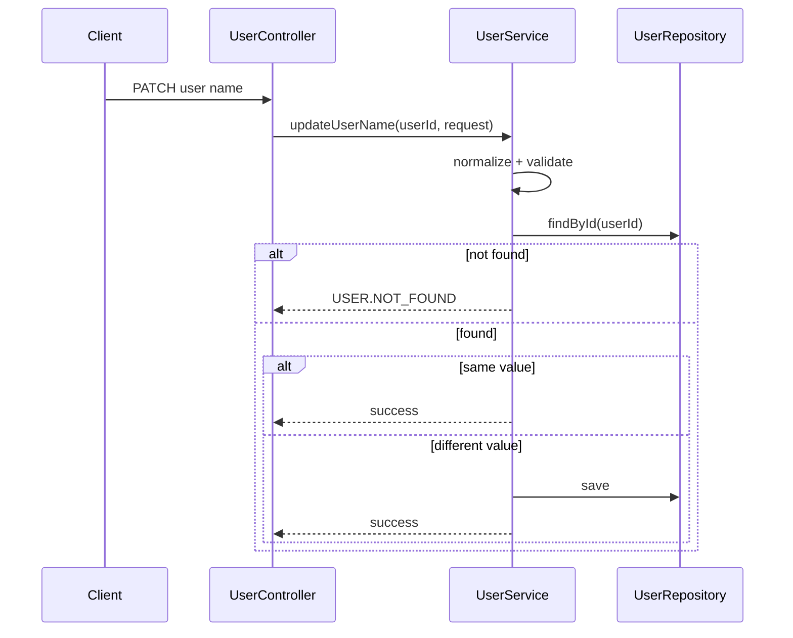

# Design Document

## Preconditions

本書は「`update-user-name` が未実装である」前提で作成する事前設計である。
実装済みコードの有無に関係なく、仕様駆動で本来先に固定すべき内容を記述する。

## Overview

`userId` で特定したユーザーの表示名を更新する機能を追加する。
`requirements.md` のドメインルール（正規化、妥当性、認証、同値更新の冪等、不存在拒否）を、既存レイヤ構造で実現する。

## Design Goals

- ドメインルールを Service 層で一貫適用する
- 契約情報は OpenAPI に一元化する
- 既存エラーモデルと例外処理基盤を再利用する
- テストで受け入れ基準を機械的に検証可能にする

## Non-Goals

- HTTP 契約の詳細を Markdown に重複定義しない
- 楽観ロック/競合解決（409）を導入しない
- 新規テーブル追加や DB スキーマ変更を行わない

## OpenAPI As Contract Source of Truth

Interface / error response は以下を参照し、Design には再定義しない。

- Path: `openapi/paths/users-userId-update-user-name.yaml`
- Parameter: `openapi/components/parameters/userIdPath.yaml`
- Request Schema: `openapi/components/schemas/requests/UpdateUserNameRequest.yaml`
- Response Schema: `openapi/components/schemas/responses/UserResponse.yaml`
- Error Schema: `openapi/components/schemas/errors/ErrorResponse.yaml`

変更順序は `requirements.md` -> OpenAPI -> 実装 -> テストの順とする。

## Architecture

### Planned Flow

1. Controller がリクエストを受理し、Service に委譲する
2. Service が表示名を正規化（trim）する
3. Service が正規化後の値でドメイン妥当性を評価する
4. Repository から対象ユーザーを取得する
5. 対象が存在しない場合は `USER.NOT_FOUND` を返却する
6. 同値更新は成功として返却する（不整合を発生させない）
7. 非同値更新は保存して返却する

## Components and Responsibilities

### Controller Layer (planned)

- 役割:
  - 認証済みリクエストの入口
  - リクエスト受理と Service への委譲
- 非役割:
  - ドメインルール（trim/同値判定/存在確認）は保持しない

### Service Layer (planned)

- 役割:
  - 正規化（trim）
  - 正規化後バリデーション
  - `userId` 存在確認
  - 同値更新判定
  - 永続化オーケストレーション
- 非役割:
  - HTTP 仕様の解釈

### Repository Layer (planned)

- 役割:
  - `userId` による取得と保存

## Domain Rules Realization

- Display Name normalization:
  - 前後空白を除去した値を正規値として扱う
- Validation timing:
  - 必須・長さの評価は正規化後の値で行う
- Idempotent same-value update:
  - 正規化後同値なら成功扱い
  - 追加レコード作成など観測可能な不整合を起こさない
- Missing resource:
  - 対象ユーザー不存在時は `ErrorCode.USER_NOT_FOUND` を使用

## Error Handling Design

- ステータスコード/エラーレスポンス形式は OpenAPI 参照
- ドメインエラーコードは `ErrorCode` を再利用
  - `USER.NOT_FOUND`
- 例外変換と最終レスポンス形成は既存 `GlobalExceptionHandler` を利用

## Data and Persistence

- 既存 `users` テーブルを利用し、スキーマ変更は行わない
- 既存 `UserEntity` の更新フローを利用する

## Testing Design

### Unit Test (Service)

- 正規化（trim）が適用されること
- 正規化後バリデーションが機能すること
- 同値更新が成功扱いであること
- 不存在時に `USER.NOT_FOUND` が返ること

### Web Test (Controller)

- OpenAPI 契約に沿った入出力が成立すること
- 妥当性違反時に適切に拒否されること
- フォーマット不正時に適切に拒否されること

### Scenario / Integration Test

- 正常更新
- 前後空白トリム更新
- 同値更新の冪等
- 未認証拒否
- 対象ユーザー不存在拒否

## Design Constraints

- Interface と error response の詳細は OpenAPI を優先し、Markdown に重複記載しない
- 実装前レビューは `requirements.md` と OpenAPI 差分の整合確認を必須とする
