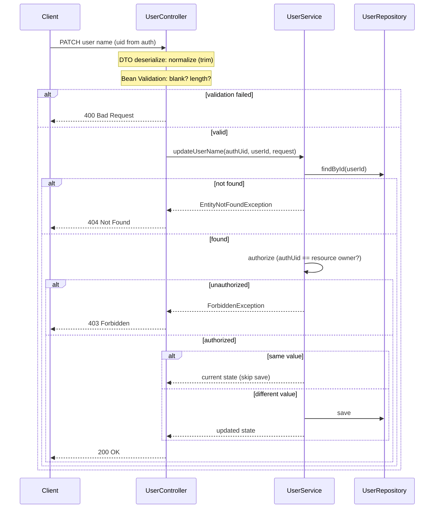

# Design Document

## Overview

`requirements.md` で定義されたドメイン要件（正規化、バリデーション、認証・認可、同値更新の冪等、不存在拒否）を、既存レイヤ構造で実現する。

## Design Goals

- ドメインルールを Service 層で一貫適用する
- 認可チェックを Service 層でリソース取得と同時に行う
- バリデーションは「正規化 → 検証」の順序を DTO 層で保証する
- 契約情報は OpenAPI に一元化する
- 既存エラーモデルと例外処理基盤を再利用する
- テストで受け入れ基準を機械的に検証可能にする

## Non-Goals

- HTTP 契約の詳細を Markdown に重複定義しない
- 楽観ロック/競合解決を導入しない
- 新規テーブル追加や DB スキーマ変更を行わない

## OpenAPI As Contract Source of Truth

Interface / error response は以下を参照し、Design には再定義しない。

- Path: `openapi/paths/users-userId-update-user-name.yaml`
- Parameter: `openapi/components/parameters/userIdPath.yaml`
- Request Schema: `openapi/components/schemas/requests/UpdateUserNameRequest.yaml`
- Response Schema: `openapi/components/schemas/responses/UserResponse.yaml`
- Error Schema: `openapi/components/schemas/errors/ErrorResponse.yaml`
- Error Examples: `openapi/components/examples/errors/*.yaml`

変更順序は `requirements.md` → OpenAPI → テスト（RED）→ 実装（GREEN）の順とする。

## Architecture

### Planned Flow

1. Controller が認証済みリクエストを受理する
2. DTO のデシリアライズ時に正規化（trim）が実行される
3. Bean Validation が正規化後の値に対してバリデーションを実行する（必須・長さ）
4. Controller が認証済み UID とともに Service に委譲する
5. Service が Repository から対象ユーザーを取得する
6. 対象が存在しない場合は `EntityNotFoundException` で拒否する
7. Service が認可チェックを行う（認証済み UID とリソースオーナーの一致確認）
8. 認可不一致の場合は `ForbiddenException` で拒否する
9. 正規値が現在値と同一なら永続化をスキップし、現在の状態をそのまま返却する
10. 非同値なら表示名を更新・保存して返却する

```mermaid
sequenceDiagram
    participant C as Client
    participant API as UserController
    participant S as UserService
    participant R as UserRepository

    C->>API: PATCH user name (uid from auth)
    Note over API: DTO deserialize: normalize (trim)
    Note over API: Bean Validation: blank? length?
    alt validation failed
        API-->>C: 400 Bad Request
    else valid
        API->>S: updateUserName(authUid, userId, request)
        S->>R: findById(userId)
        alt not found
            S-->>API: EntityNotFoundException
            API-->>C: 404 Not Found
        else found
            S->>S: authorize (authUid == resource owner?)
            alt unauthorized
                S-->>API: ForbiddenException
                API-->>C: 403 Forbidden
            else authorized
                alt same value
                    S-->>API: current state (skip save)
                else different value
                    S->>R: save
                    S-->>API: updated state
                end
                API-->>C: 200 OK
            end
        end
    end
```

## Components and Responsibilities

### DTO Layer

- 役割:
  - デシリアライズ時の正規化（コンストラクタで trim）
  - Bean Validation による正規化後バリデーション（`@NotBlank`, `@Size`）
- 非役割:
  - ドメインロジック（同値判定・存在確認）

### Controller Layer

- 役割:
  - 認証済みリクエストの入口
  - 認証済み UID を Service に受け渡す
  - Service への委譲
- 非役割:
  - 認可判定（Service 層の責務）
  - ドメインルール（同値判定・存在確認）は保持しない

### Service Layer

- 役割:
  - ユーザー存在確認
  - 認可チェック（リソース取得後に認証済み UID とリソースオーナーを比較）
  - 認可不一致時の `ForbiddenException` 送出
  - 同値更新判定と永続化スキップ
  - 非同値時の永続化オーケストレーション
- 非役割:
  - HTTP 仕様の解釈
  - 正規化・バリデーション（DTO 層の責務）

### Repository Layer

- 役割:
  - `userId` による取得と保存
- 非役割:
  - ドメインロジック（存在確認の判定、認可チェック）
  - 正規化・バリデーション

## Domain Rules Realization

### Normalization and Validation

DTO のコンストラクタでデシリアライズ時に前後空白を除去し、正規化後の値に対して Bean Validation を適用する。これにより requirements.md の Processing Order（正規化 → バリデーション）を保証しつつ、Controller 到達時点で早期フィードバックを得る。

制約の具体値（長さ上限等）は OpenAPI request schema を参照:
`openapi/components/schemas/requests/UpdateUserNameRequest.yaml`

### Authorization

Service がリソースを取得した後、認証済み UID とリソースオーナー（`UserEntity.authUser.uid`）を比較する。不一致の場合は `ForbiddenException` を送出する。リソース取得と認可を同一メソッドで行うことで、Controller から Repository への不要な依存を避ける。

### Idempotent Same-Value Update

正規化後の値が現在の表示名と同一の場合:

- `save()` を呼ばない（永続化をスキップ）
- `updated_at` は変更されない
- レスポンスは現在の状態をそのまま返却する（正常更新と同一の成功レスポンス）

### Missing Resource

対象ユーザー不存在時は `EntityNotFoundException` を送出する。
エラーコードとレスポンス形式は OpenAPI path spec の 404 レスポンス定義を参照。

## Error Handling Design

ステータスコード・エラーコード・レスポンス形式の詳細は OpenAPI path spec を参照:
`openapi/paths/users-userId-update-user-name.yaml`

実装上のエラー処理方針:

- 認可不一致は `ForbiddenException` を送出する
- ユーザー不存在は `EntityNotFoundException` を送出する
- 例外変換と最終レスポンス形成は既存 `GlobalExceptionHandler` を利用する
- 認証エラーは `TatecaAuthenticationFilter` で処理される（Controller に到達しない）

## Data and Persistence

- 既存 `users` テーブルを利用し、スキーマ変更は行わない
- 既存 `UserEntity` の更新フローを利用する

## Testing Design

### 外部仕様テスト

#### Scenario Test (Acceptance)

- 責務: `requirements.md` の Acceptance Criteria が HTTP レベルで充足されることを検証する（ブラックボックス）
- 非責務: レスポンスのスキーマ構造検証（Controller Web Test の責務）、内部実装の詳細（Repository 呼び出し回数等）
- 基盤: `AbstractIntegrationTest` + `MockMvc`（フルスタック）

検証項目:
- 正常更新とその永続化確認
- 前後空白トリム更新
- 同値更新の冪等性（`updated_at` 非更新を含む）
- バリデーションエラー（空値、長さ超過）
- 認可拒否（他ユーザーのリソースへのアクセス）
- 未認証拒否
- 不正 JSON 拒否
- 対象ユーザー不存在拒否

#### Controller Web Test (@WebMvcTest)

- 責務: HTTP インターフェース契約の準拠を検証する（レスポンス構造、ステータスコード、エラー形式、Bean Validation 発火）
- 非責務: ビジネスロジックの正しさ（Service は Mock）、データの永続化確認
- 基盤: `@WebMvcTest(UserController.class)` + `@MockitoBean UserService`

検証項目:
- 各ステータスコード（200, 400, 403, 404, 415）のレスポンス構造が OpenAPI スキーマの必須フィールドに一致すること
- `error_code` が OpenAPI の examples に定義された許容値と一致すること
- Bean Validation が正しく発火すること（空値、null、キー欠落、長さ超過）
- Service への正しい委譲（引数、呼び出し回数）
- Service が例外を投げた場合に正しい HTTP レスポンスに変換されること

DTO の正規化（trim）と Bean Validation の発火はこのレイヤーで検証される。DTO 単体テストは設けない（Controller Web Test が Bean Validation を実際に発火させるため冗長）。

### 内部仕様テスト

#### Unit Test (Service)

- 責務: Service 層のドメインロジック（認可・存在確認・冪等更新）が正しく機能することを検証する
- 非責務: HTTP レスポンス形式、認証、データベース永続化、正規化・バリデーション
- 基盤: Mockito（Repository をモック）

検証項目:
- 認可不一致時に `ForbiddenException` が送出されること
- 不存在時に `EntityNotFoundException` が送出されること
- 同値更新時に `save()` が呼ばれないこと
- 非同値更新時に `save()` が呼ばれること

#### Integration Test (Persistence)

- 責務: Unit Test では検証不可能な永続化レイヤーの振る舞いを実 DB で検証する
- 非責務: ドメインロジックの正しさ（Unit Test の責務）、認可・存在確認（Unit Test で完全カバー済み）
- 基盤: `AbstractIntegrationTest`（Testcontainers MySQL）

検証項目:
- `@PreUpdate` による `updated_at` タイムスタンプの更新
- 同値更新時に `save()` スキップにより `updated_at` が変更されないこと
- マルチバイト文字・絵文字の DB エンコーディング
- 正規化済みの値が DB に正しく永続化されること
- `authUser` リレーションの保持

## Design Constraints

- Interface と error response の詳細は OpenAPI を優先し、Markdown に重複記載しない
- 実装前レビューは `requirements.md` と OpenAPI 差分の整合確認を必須とする
